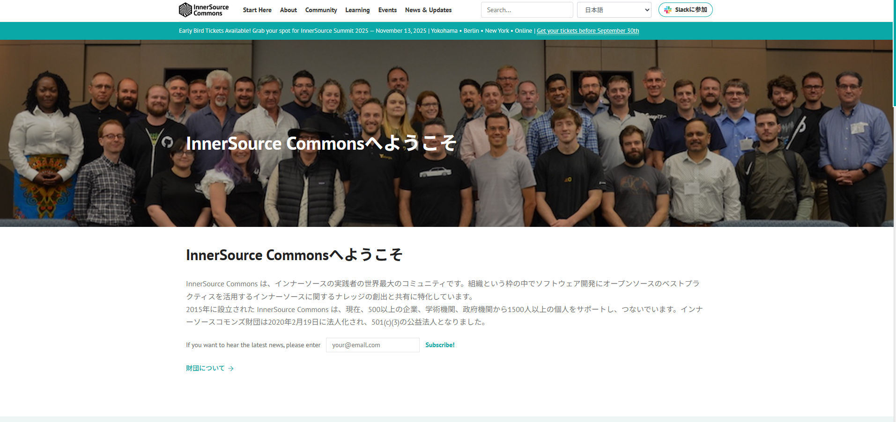
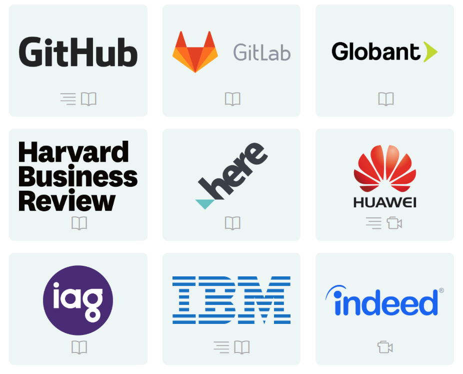

<!-- _class: title -->
<!-- _paginate: false -->

# Inner Sourceのススメ

2025/11/12
@ebi-yu

---

# アジェンダ

- Inner Sourceとは
- 具体的に何をするの？
- 導入のメリット
- 導入で得られる副次的な効果
- 導入のために必要なこと
- まとめ
- 他企業での事例

---

# アジェンダ

- Inner Sourceとは
- 具体的に何をするの？
- 導入のメリット
- 導入で得られる副次的な効果
- 導入のために必要なこと
- まとめ
- 他企業での事例

---

# Inner Sourceとは

# オープンソース(OSS)開発の考え方を企業組織でのソフトウエア開発に取り入れる取り組み

> インナーソースは、オープンソースソフトウェアの開発から得た教訓を、企業の社内でのソフトウェア開発のあり方に応用します。開発者は世界トップクラスのオープンソースソフトウェアに慣れるにつれて、これらの手法をファイアウォールの内側に戻し、企業がリリースを躊躇するようなソフトウェアに適用したいと強く思うようになりました。
> インナーソースは、主にクローズドソースのソフトウェアを構築している企業にとって、サイロの解消、社内コラボレーションの促進および拡大、新しいエンジニアのオンボーディングの促進、そしてオープンソースの世界にソフトウェアを還元するチャンスを探るのに役立つ役立つ素晴らしいツールです。

 

<https://innersourcecommons.org/ja/>

---

# Inner Sourceコミュニティ

<a href="https://innersourcecommons.org/ja/">https://innersourcecommons.org/ja/</a>

---

# Inner Source導入企業

<a href="https://innersourcecommons.org/ja/stories/">https://innersourcecommons.org/ja/stories/</a>

---

<h1>そもそもOSSがようわからん...</h1>

---

# OSSとは

 OSSとは **「ソースコードが公開されており、誰でも自由に利用・改変・再配布できるソフトウェア」** のこと

※実際にはライセンスによって細かい条件が異なる

---

# 代表的なOSS

- Linux
- Vue.js
- Node.js
- PostgreSQL
- Keycloak
- ...etc

 
 
 

 

---

# なぜOSSのサービスが幅広く使われているのか

- **「誰でも自由に利用・改変・再配布できる」** ため企業が自社サービスの基盤として採用しやすい
- 世界中の開発者が **「バグ修正や新機能追加」** に貢献しているため品質が高い
- 開発者コミュニティが活発であり、 **「最新技術の導入やトレンドの反映」** が早い

---

自社のサービスもOSSのように品質が高いものにしたい、、、

---

---

# OSSの文化を社内に取り入れる取り組みがInner Source

長年のオープンソースソフトウェア開発で培われた「ソフトウェア開発の教訓」を、社内でも取り入れる取り組み

 

● コードのメンテナンスがされてない...

● ドキュメントが整備されていない...

● 特定の人しか解読できないプロジェクト...

● チーム間の壁が高くてコラボレーションできない...

 

→ これらの課題を解決するための取り組み。

---

# アジェンダ

- Inner Sourceとは
- 具体的に何をするの？
- 導入のメリット
- 導入で得られる副次的な効果
- 導入のために必要なこと
- まとめ
- 他企業での事例

---

# 具体的に何をするの？

- 社内で管理されているソースコードを **「組織やチームの壁」** を越えて公開します。
- 社内の誰もが **「ソースコードを修正したり、新しい機能を提案」** できるようにします。
- **InnerSourceに参加しない選択をすることも可能です。**
  - 社内に公開できないプロジェクト、機能提案を必要としないプロジェクトなど。

---

# Q : 誰もがコードを修正できたら、危険じゃないの？

- InnerSourceでは **「コードの変更を直接反映するのではなく、Pull Request(PR)を通じて提案」** します。
- PRは **「コードオーナーやレビュアーが内容を確認してからマージ」** されます。
- これにより **「コードの品質を維持」** しつつ、 **「組織やチームの壁を越えたコラボレーション」** を促進できます。

 

→ 今までの開発フローは大きく変わらない

---

# Q : そんな簡単に他のチームのコードを理解できなくない？

- InnerSourceを導入する際に、 **「READMEやCONTRIBUTINGなどのドキュメントを整備」** します。
- ドキュメントには **「プロジェクトの目的、セットアップ方法、コントリビューションの手順」** などを記載します。
- またテストコードやCI/CDパイプラインを整備することで、 **「コードの品質を担保」** します。

 

→ InnerSource化しようとすると、おのずとドキュメント整備やテストコードの充実が進む

---

# アジェンダ

- Inner Sourceとは
- 具体的に何をするの？
- 導入のメリット
- 導入のために必要なこと
- まとめ
- 他企業での事例

---

# 導入のメリット

#### 重複開発の削減と品質向上

InnerSourceを導入したサービスは他のチームの目に触れやすくなるため**同じような機能を別々に開発する**といったことが減る。また、複数のチームからのフィードバックを得られるため **「サービスの品質向上」** が減り、再利用されやすくなる。

 

#### 組織間コラボレーションの促進

組織間の壁を越えたコラボレーションが生まれやすくなる。
これにより **「複数のチームの知見を活用した開発」** が可能になる。

 

#### 開発スピードの向上

あるチームが管理しているサービスに機能を追加しり、バグを修正したい場合に **「そのチームの対応を待つ必要がなくなる」**

---

# 導入で得られる副次的な効果

#### ドキュメントの整備の促進

InnerSourceを導入することで **「READMEやCONTRIBUTINGなどのドキュメントを整備」** する必要があるため、ドキュメントの整備が促進される。これにより **「新しいメンバーのオンボーディングが容易になる」** といった効果も期待できる。

 

#### 社員のエンゲージメントの向上

自分の所属するチーム以外のプロジェクトに参加できることで **「新しい刺激を得たり、成長を感じる」** ことができる。これにより社員の精神的な満足度が向上し、離職率の低下が期待できる。

 

#### 採用活動でのアピールポイントになる

InnerSourceを導入していることは **「技術的に先進的な企業である」** ことのアピールポイントになる。これによりより優秀な人材を採用できる可能性が高まる。

---

# アジェンダ

- Inner Sourceとは
- 具体的に何をするの？
- 導入のメリット
- 導入のために必要なこと
- 他企業での事例
- 最後に

---

# 導入のために必要なこと

#### 権限の明確化

InnerSourceを導入するためには **「誰がどのコードにアクセスできるか」** を明確にする必要がある。これにより **「セキュリティリスクを最小化」** できる。

 

#### ドキュメントの整備

チーム外の人が理解できるように **「READMEやCONTRIBUTINGなどのドキュメントを整備する」** 必要がある。また、IssueやPull Requestのテンプレートも用意する必要がある。

 

#### チーム外のタスクを行うことを許容する

InnerSourceを導入するためには自分の本業以外のタスクを行うことを許容する必要がある。
プロジェクトやチーム内だけではなく **「組織全体の目標を達成するために貢献する」** 文化や **「心理的安全性」** を醸成する必要がある。

---

# アジェンダ

- Inner Sourceとは
- 具体的に何をするの？
- 導入のメリット
- 導入のために必要なこと
- 他企業での事例
- まとめ

---

# 他企業での事例 : Salesforce

#### 背景  

各チームが同様の機能を別々に開発し、重複・非効率が発生。  
共通基盤の共有と協働が必要に。

 

#### 取組内容  

- 重複機能を共通モジュール化（マニフェスト生成・Git操作・Slack通知）  
- Inner Source 文化で全社的に公開・貢献可能に  
- テスト・品質ゲートで信頼性確保（例：SonarQube）

 

#### 効果  

- 開発速度向上・再利用促進  
- コード品質と一貫性向上  
- チーム間コラボが活発化  

---

# 他企業での事例 : ニフティ株式会社

#### 背景

- チームごとに独立開発しており、**依頼集中や重複作業**が発生。  
- GitHub Organization 全体で見ても、**横断的なコラボが少なかった**。

 

#### 取組内容

- 一部リポジトリで**README整備・Lint/Test導入・good first issue設置**を試験導入。  
- 社内向け「ポータル／ガイドライン」で**貢献しやすい仕組み**を整備。  
- **ビジネス部門もPR可能**にし、部門を越えた協働を促進。

 

#### 効果

- 実験中に複数メンバーがPR・Issueで参加し、**非エンジニアも貢献可能に**。  
- **属人化の解消・知見共有・効率化**への手応えを確認。

---

# アジェンダ

- Inner Sourceとは
- 具体的に何をするの？
- 導入のメリット
- 導入のために必要なこと
- 他企業での事例
- 最後に

---

# 創始者の方が来日されたときのレポ

<https://zenn.dev/ymd65536/articles/inner_source_commons#%E3%82%A4%E3%83%B3%E3%83%8A%E3%83%BC%E3%82%BD%E3%83%BC%E3%82%B9%E3%81%A8%E3%81%AF>

---

# 最後に

> InnerSource は狭義も広義も「協働モデル」です。 すなわち InnerSource の実践を通して組織内の協働を推し進めたい意図があるわけです。
>
> 組織において協働モデルの実践が必要ということは、裏を返せば異なる目的に対して協力せずに単独で働いている、という現状があるはずです。 とはいえ組織で一度でも働いたことがあればなんとなく意味するところはわかると思います。

 

同じ目的のために、対等の立場で協力して共に働くこと。

 

<https://bory-kb.hatenablog.com/entry/2024/10/23/190552>

---

# 本当の最後に

InnerSource導入チームのメンバーを募集中!

---

<!-- _class: all-text-center align-center -->

# ご清聴ありがとうございました
