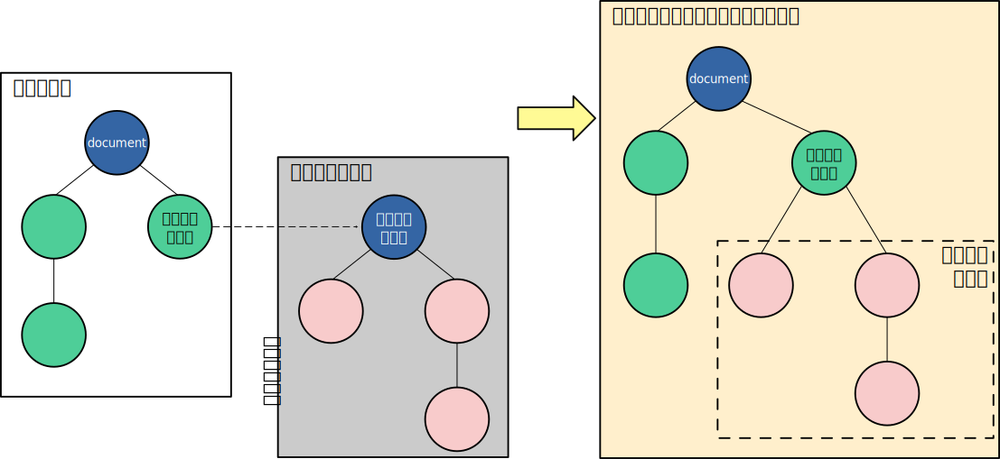

# Web Componentsとは : Web標準技術でコンポーネントを使用する

今回のWebinarでは、Web Componentsの基本的な概念と実装方法について発表します。

## Web Componentsって何?

Web Componentsとは、**再利用可能なコードブロックを作成するための技術です**  
コンポーネントは他のコードから独立しており、再利用可能で、カプセル化されたUI要素を提供します。

ReactやVue.jsでも同様の機能を提供していますが、Web Componentsは **「ブラウザのネイティブ機能」** として提供されており、フレームワークに依存しません。

<https://developer.mozilla.org/ja/docs/Web/API/Web_components>

### Componentsの例

- Vue.jsに`.vue`で定義されているもの
  - Main.vue
    - SearchForm.vue
    - SearchResultTable.vue
- Reactに`.jsx`で定義されているもの
  - App.jsx
    - SearchForm.jsx
    - SearchResultTable.jsx

ReactやVue.jsで実装されていたコンポーネントの機能がWeb ComponentsでWeb標準として使用できるようになった

### Web Componentsのメリット

- **Web標準技術である**
  - Web Componentsはブラウザのネイティブ機能であるため、フレームワークなどを使用する必要がありません。
  - コンパイルやビルドプロセスが不要で、直接HTMLに組み込むことができます。
- **複数のフレームワークでの再利用が容易**
  - Web Componentsはフレームワークに依存しないため、異なるプロジェクトやフレームワーク間でコンポーネントを簡単に再利用できます。
  - 例 : Vue.js、React、Angularなど別のフレームワークで同じコンポーネントを使用する。

### 注意点

- **古いブラウザではサポートされていない場合があります**
  - Polyfillを使用することで、古いブラウザでもWeb Componentsを使用できるらしいです。
    - <https://github.com/webcomponents/polyfills>

## Web Componentsを使ってみる

WebComponentsには、以下の3つの主要な技術が含まれています。

1. **Custom Elements**: 独自のHTML要素を定義するためのAPI
2. **Shadow DOM**: コンポーネントのスタイルと構造をカプセル化するための技術
3. **HTML Templates**: `<template>` と `<slot>` を使用して再利用可能なHTMLテンプレートを定義するための機能

### Custom Elements

Custom Elementsは、独自のHTML要素を定義するためのAPIです。

- 独自のHTML要素を作成し、JavaScriptでその動作を定義できます。
- 既存のHTML要素を拡張することも、新しい要素を作成することができます。
- Custom Elementsには以下のライフサイクルメソッドがあります：
  - `constructor()`: 要素が作成されたときに呼ばれる
  - `connectedCallback()`: 要素がDOMに追加されたときに呼ばれる
  - `disconnectedCallback()`: 要素がDOMから削除されたときに呼ばれる
  - `attributeChangedCallback()`: 監視対象の属性が変更されたときに呼ばれる

**[実装例](./samples/custom-elements/index.html)**

<https://developer.mozilla.org/ja/docs/Web/API/Web_components/Using_custom_elements>

### Shadow DOM

Shadow DOMは、コンポーネントのスタイルと構造をカプセル化するための技術です。



#### 1. スタイルのカプセル化

- Shadow DOM内のスタイルは、shadowツリー内の要素にのみ適用されます。
- 外部で定義されたスタイルは、shadowツリー内の要素には影響を与えません。
- Vue3の`<style scoped>`と同様

#### 2. スクリプトのカプセル化

- 外部のスクリプトからshadow DOM内の要素にアクセスするにはshadowRootを指定する必要があります。
  - `attachShadow({ mode: 'open' })`を使用すると、shadowRootを通じてJavaScriptからshadow DOMの要素にアクセスできます。
  - `attachShadow({ mode: 'closed' })`を使用すると、JavaScriptからshadow DOMの要素にアクセスできません。(nullが返される)
  - shadowRootを指定しないと、shadow DOM内の要素にはアクセスできません。

実装例:

- [スタイルのカプセル化](./samples/shadow-dom/style-isolation.html)
- [スクリプトのカプセル化](./samples/shadow-dom/script-isolation.html)

<https://developer.mozilla.org/ja/docs/Web/API/Web_components/Using_shadow_DOM>

### HTML Templates

HTML Templatesは、再利用可能なHTMLテンプレートを定義するための機能です。

- `<template>` タグを使用して、再利用可能なHTML構造を定義できます。
- `<slot>` タグを使用して、コンポーネントの中に外部のコンテンツを挿入することができます。
- cloneNodeを使用して、テンプレートを複製し、必要な場所に挿入できます。
  - `cloneNode(true)`: 子要素も含めて複製
  - `cloneNode(false)`: 子要素を含めずに複製

[実装例](./samples/html-templates/index.html)

## 複数のフレームワークでの利用

Web Componentsは、異なるフレームワークやライブラリで再利用可能です。

```sh
# 初回
pnpm install

# 実装例 : vue
pnpm vue
# 実装例 : react
pnpm react
```

## vue3でのWeb Components

### defineCustomElement

Vue3では、`defineCustomElement`を使用してVueコンポーネントをCustom Element(Web Components)に変換できます。

- `defineCustomElement`を使用することで、VueコンポーネントをCustom Elementとして定義できます。
- Custom Elementに変換されると、一部のVueの機能が制限されます。

<https://ja.vuejs.org/guide/extras/web-components>

#### Custom Elementでの制限事項

1. **スコープ付きスロット（Scoped Slots）がサポートされない**
   - Vue の強力なコンポーネント構成メカニズムであるスコープ付きスロットが使用できません
   - 代わりにネイティブのスロット構文（`slot` 属性）を使用する必要があります
2. **Provide / Inject の制限**
   - Provide / Inject APIはCustom Element間でのみ動作します
   - 通常のVueコンポーネントからCustom Elementへのプロパティ注入はできません
3. **スタイルの配布の制約**
   - Custom ElementではShadow DOMにスタイルを注入するため、CSSをJavaScript内に埋め込む必要があります
   - SSRの場合、マークアップに重複したスタイルが発生する可能性があります
   - Vue SFCの通常のCSS抽出機能（プレーンなCSSファイルへの抽出）が使用できません
4. **一部のVue特有の機能の非対応**
   - `v-slot` ディレクティブの代わりに `slot` 属性を使用
   - Vue DevToolsでの完全なデバッグサポートが制限される場合があります
5. **パフォーマンス上の考慮事項**
   - 単一のCustom Elementの場合、Vueランタイム（約16kb）が含まれるため、サイズが大きくなります
   - 複数の要素を作成する場合はコストが分散されるため、トレードオフが改善されます

## まとめ

- Web Componentsは、再利用可能なコンポーネントを作成するための強力な技術
- Web標準技術であり、フレームワークに依存しない
- Custom Elements、Shadow DOM、HTML Templatesの3つの主要な技術を使用
- 複数のフレームワークでの再利用が容易なため、異なるふれーむわプロジェクト間でのコンポーネントの共有が可能
